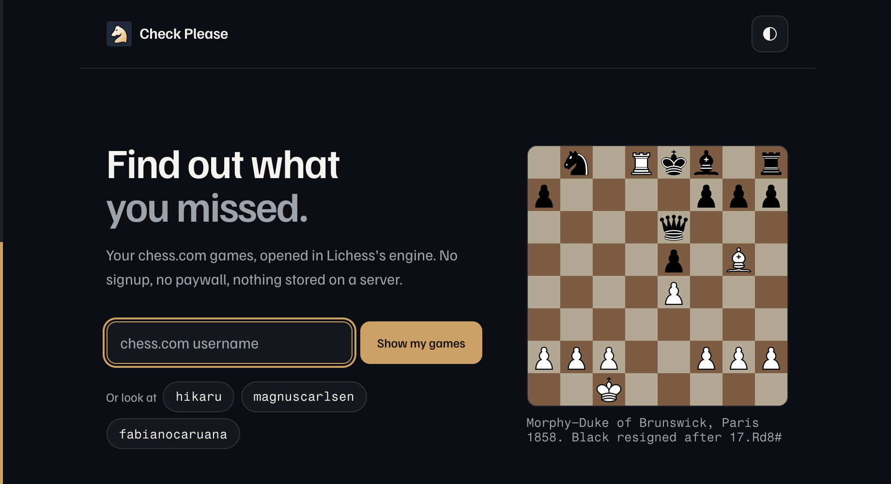
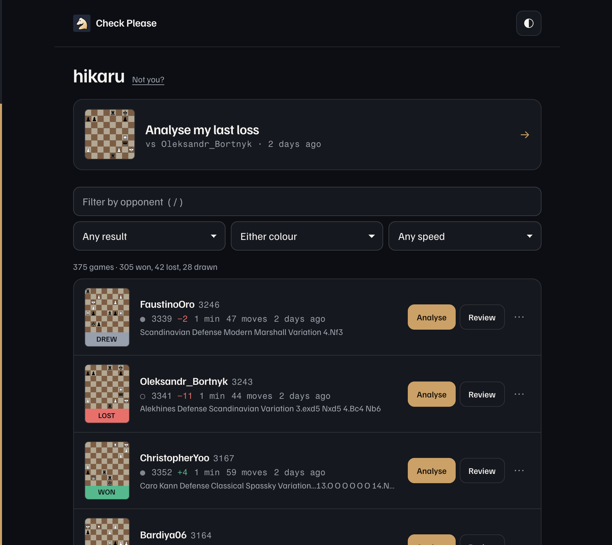

<h1 align="center">Check Please</h1>

<p align="center">
  <a href="https://roeibh.github.io/check-please/"></a>
  <a href="https://github.com/roeibh/check-please/actions/workflows/deploy.yml"></a>
  <a href="https://github.com/roeibh/check-please/stargazers"></a>
  
  
  <a href="LICENSE"></a>
</p>

<p align="center">
  
</p>

> Your chess.com games, opened in Lichess's engine. No signup, no paywall, no server.

You just lost a game, you want to know what went wrong, and chess.com wants money for the answer.
Type your username here and every game gets a one-click link into
[Lichess](https://lichess.org)'s analysis board, which is free, open source, and run by a nonprofit.

Nothing is stored on a server because there is no server. The whole site is static files and it
runs entirely in your browser.

<p align="center"><b><a href="https://roeibh.github.io/check-please/">Open it &rarr;</a></b></p>

## What it does

- **Analyse my last loss.** One click from landing to the engine, at the position where it ended.
- Every row has two actions. **Analyse** opens the Lichess board at the final position instantly.
  **Review** imports the game so Lichess can give you per-move blunder labels and an accuracy
  score, the way chess.com's Game Review does. That one costs about a minute.
- Your username is remembered, so the next visit goes straight to your games.
- `?u=username` links are shareable and bookmarkable.
- Filter by result, colour, speed, and opponent. Instant, no submit button.
- Per game: copy PGN, download PGN, open the original on chess.com, or import to Lichess with their server-side computer analysis.

## The part worth stealing

**Opening a game costs zero API calls.**

Lichess will build an analysis board straight from a URL, which almost nobody seems to know:

```
https://lichess.org/analysis/pgn/e4_e5_Nf3_Nc6_Bc4#6
```

So the button is a plain `<a href>` assembled from movetext chess.com already returned. No import
request, no rate limit, no spinner, no popup blocker, and cmd-click opens a background tab like any
other link. A 51-ply game is a 236-character URL.

The `#6` is a ply anchor, which is how every game opens at the position where it actually ended.

<p align="center">
  
</p>

Each row shows **its own final position**, and that board is the result cell. The rating change sits
beside it, and distinguishes four different things rather than collapsing them: `+24`, `±0` for a
game that genuinely moved nothing, `—` for one whose earlier reference game has not loaded yet, and
`unrated`.

## How it works

```
chess.com public API  ──►  parse PGN in the browser  ──►  lichess.org/analysis/pgn/<moves>#<ply>
```

Archives are cached in `localStorage`. A completed month can never change, so it is cached forever
and never refetched; only the live month touches the network.

## API findings

Everything here was verified against the live endpoints before any app code was written. Several
details contradict the docs or the obvious assumption, so they are recorded rather than
rediscovered later.

<details>
<summary><b>chess.com</b> &mdash; 10 findings, including one that makes conditional requests impossible</summary>

<br>

| # | Finding |
|---|---|
| 1 | **Usernames must be lowercased.** `/pub/player/2_Queens_1Cup/games/archives` returns **301**, not 200, with a JSON body pointing at the lowercase URL. `fetch` follows it, but lowercasing client-side saves a round trip. |
| 2 | CORS is `access-control-allow-origin: *` on all `/pub/` endpoints. Browser `fetch` works with no proxy. |
| 3 | **`accuracies` is present on only about half of games.** It exists only where someone ran chess.com's Game Review, so it cannot be a load-bearing field. |
| 4 | **`eco` is a URL, not an opening name** (`.../openings/Queens-Pawn-Opening-Mikenas-Defense`). The name has to be unslugged. |
| 5 | **There is no rating-delta field.** It must be derived by diffing consecutive games *within the same `time_class`*, because rapid, blitz and daily are separate rating pools. |
| 6 | **`rating` is the POST-game rating.** Verified by checking the sign of every delta against its own game's result across a full month. Diffing against the previous game therefore attributes the swing to the correct game. |
| 7 | `fen` is the **final** position. `initial_setup` is the start. |
| 8 | Result codes: the winner is always `win`; the loser carries the descriptive code (`checkmated`, `resigned`, `timeout`, `abandoned`). Draws put the *same* code on both sides: `agreed`, `repetition`, `stalemate`, `insufficient`, `50move`, `timevsinsufficient`. |
| 9 | **Conditional requests are impossible from JS.** The preflight returns `access-control-allow-headers: Origin` only, so sending `If-None-Match` gets the request blocked outright. `curl` gets a 304 because `curl` is not subject to CORS. We rely on the browser's own HTTP cache plus the fact that completed months are immutable. |
| 10 | The archives list only contains months that actually have games, so the last entry is always the most recent month with content. Missing user gives `404` with `{"code":0,"message":"User \"x\" not found."}`. |

Game object shape:

```
url, uuid, pgn, fen, tcn, time_class, time_control, rated, rules,
end_time, start_time, initial_setup, eco,
white/black: { username, rating, result, @id, uuid },
accuracies?: { white, black }        // optional, ~50% of games
```

</details>

<details>
<summary><b>Lichess</b> &mdash; 7 findings, including the URL trick above and two errors in the common wisdom</summary>

<br>

| # | Finding |
|---|---|
| 11 | **The analysis board can be built from a URL with no import at all**: `https://lichess.org/analysis/pgn/e4_e5_Nf3`. Documented in the API spec but easy to miss. Zero API calls, no rate limit, works as a plain link. This is what the site uses. |
| 12 | It accepts a **`#<ply>` anchor**, so games open at the final position. `/<id>/black#<ply>` also orients the board. |
| 13 | **The paste form posts to `/import`, not `/paste`.** `/paste` is the GET page that renders the form. There is no CSRF token, so an anonymous form POST works. |
| 14 | The form has an **`analyse=true`** field, but **it does not fire for anonymous imports**. The imported game still renders a "Request a computer analysis" button that has to be clicked. Corrected after testing: an earlier version of this table claimed it was automatic, based on reading the form rather than running it. |
| 14b | **Move classifications require an import, not the analysis board.** `/analysis/pgn/...` has a live engine but no per-move judgments, because the game is not saved on Lichess so there is nothing to annotate. An imported game, after one click, returns exactly what chess.com's Game Review shows. Measured on a 43-ply game: 50 seconds, anonymous, no login. |

Analysis output from `GET /game/export/{id}?evals=true&accuracy=true` once it completes:

```json
"players": { "white": { "inaccuracy": 5, "mistake": 1, "blunder": 1,
                        "acpl": 39, "accuracy": 84 } },
"analysis": [ { "eval": 148, "best": "c7c6",
                "judgment": { "name": "Blunder", "comment": "Blunder. c6 was best." } } ]
```
| 15 | **`POST /api/import` returns `{id, url}` only if you send `Accept: application/json`.** Without it you get a **303** to `/<id>`, and `Location` is *not* in `access-control-expose-headers`, so JS cannot read it. The game page sends no CORS headers either, so following the redirect from `fetch` also fails. |
| 16 | Importing the same PGN twice returns the **same game id**. Lichess dedupes, which protects the rate limit. |
| 17 | **Rate limits**, quoted from the spec: *"200 games per hour for OAuth requests, 100 games per hour for anonymous requests"*, and *"Only make one request at a time... If you receive a 429... waiting one minute before retrying will be sufficient."* |

</details>

<details>
<summary><b>The bug that returns 200 either way</b></summary>

<br>

`#` is a legal character in SAN: it marks checkmate (`Qxf7#`). Unencoded in a URL it starts the
fragment and **silently drops the mating move**. Lichess still returns 200, so no status code
reveals it; the only symptom is a board missing its last move.

Moves are `encodeURIComponent`-ed, and `test/lichess.test.js` pins it.

</details>

### Rate limit behaviour

Imports fire **only on an explicit click**, never in bulk and never on page load. Because the
default path is a constructed URL rather than an import, normal use consumes no import quota at
all. Import is used only for games too long to fit in a URL, or when you explicitly ask for
Lichess's server-side analysis.

## Run it locally

```bash
npm install
npm run dev      # http://localhost:5173/check-please/
npm test
npm run build    # -> dist/
```

The Vite `base` is `/check-please/` for the GitHub project page. For a user page or a custom domain,
build with `BASE=/ npm run build`.

There is no `404.html`: the app uses a `?u=` query parameter rather than client-side path routing,
and query strings never produce a 404. If you add path-based routes, copy `index.html` to `404.html`
in the build.

## Tests

`npm test` covers the things that break quietly rather than loudly. The deploy workflow runs it
before every build, so the badge above going green means the suite passed.

| Area | What is pinned |
|---|---|
| PGN extraction | Clock comments, nested variations, castling, promotion, checkmate suffixes |
| URL building | The `#` encoding above, ply anchors, length limits, round trip through `URL` |
| Result parsing | Every draw code, unfamiliar loss codes, case-insensitive usernames |
| Rating deltas | Pool isolation, unrated games, and a real zero staying distinct from an unknown |
| Board rendering | FEN edge cases, flipped orientation, illegal characters that would escape an SVG attribute |
| Archive caching | Completed months never refetch, the live month always does, and a `QuotaExceededError` still returns games to the caller |

That last one is not hypothetical: a prolific player's single monthly archive can exceed the whole
~5 MB `localStorage` quota, so the cache failing is an expected path, not an exceptional one.

## Design

`DESIGN.md` holds the system (palette in OKLCH, type, layout rules). `PRODUCT.md` holds the voice
and the anti-references.

Two things to know before touching the UI:

- Results are written in **plain words**, not crosstable notation. An earlier build used `1` / `0` /
  `½`, which reads instantly to tournament players and means nothing to everyone else. Chess
  literacy is not the price of entry here.
- Contrast is **measured, not eyeballed**. Every foreground/background pair in both themes clears
  WCAG AA; the tightest is 4.85:1.

Boards are data, never decoration. Every board on the site shows a real position.

## Contributing

Issues and pull requests welcome. There are templates for
[bugs and feature requests](https://github.com/roeibh/check-please/issues/new/choose).

Keep it static. No backend, no API keys, no build-time secrets. That constraint is what makes the
site free to host and the privacy claim true. Run `npm test` before opening a PR, and if you change
how the APIs are called, update the findings above.

**Using an AI agent?** Point it at [`AGENTS.md`](AGENTS.md) first. It carries the constraints, the
verified API behaviour, and a list of the bugs this repo has already shipped so they do not come
back. Most of them looked fine until they were measured.

## Credit

[Lichess](https://lichess.org) does the actual work here. It is free, open source, ad-free, and run
by a nonprofit, which is an unusually good thing on the modern internet.

**[Donate to Lichess &rarr;](https://lichess.org/patron)**

## Legal

Not affiliated with, endorsed by, or connected to Chess.com or Lichess. Both marks belong to their
owners. Game data comes from chess.com's public API.

Code is [MIT](LICENSE). **The chess piece artwork is not.** The pieces in `src/pieces.js` are by
[Cburnett](https://commons.wikimedia.org/wiki/User:Cburnett) via Wikimedia Commons, licensed
[CC BY-SA 3.0](https://creativecommons.org/licenses/by-sa/3.0/), the same set Lichess and Wikipedia
use. That is a share-alike licence: modify the artwork and you must release it under CC BY-SA 3.0
too. Attribution is in the page footer and must stay there.
