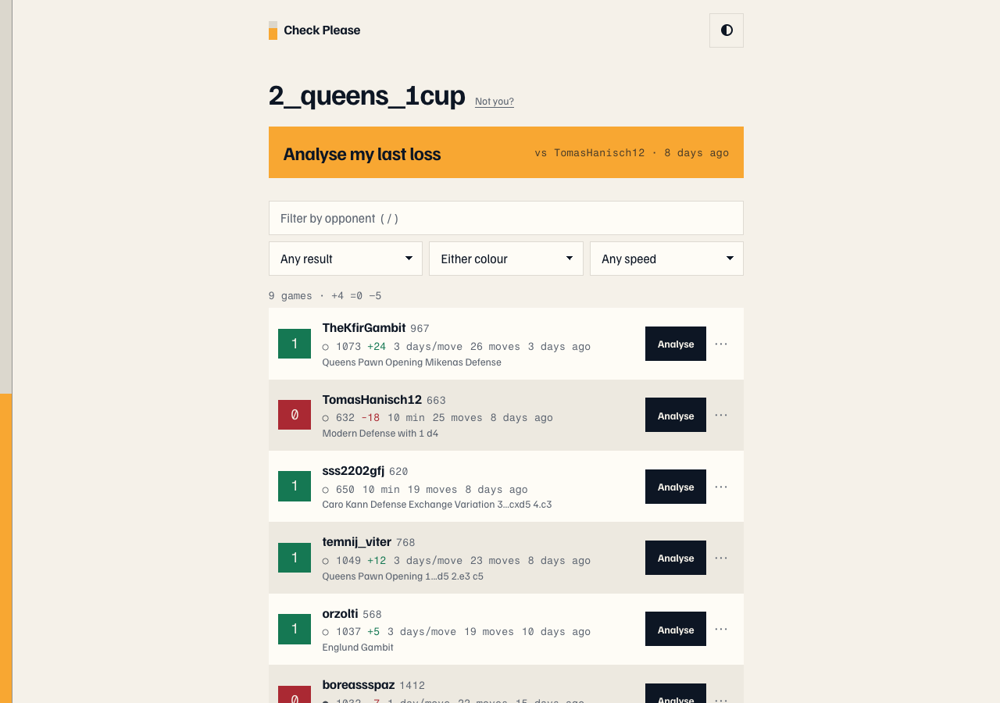

# Check Please

Analyse your chess.com games free on Lichess. Type a username, click once, get a real engine.

**[roeibh.github.io/check-please](https://roeibh.github.io/check-please/)**



You just lost a game, you want to know what went wrong, and chess.com wants money for the answer.
This takes your username and hands every game straight to Lichess's analysis board — which is free,
open source, and run by a nonprofit.

No signup, no accounts, no server. The whole site is static files; everything runs in your browser.

## What it does

- Type a chess.com username. It's remembered in `localStorage`, so the next visit skips straight to your games.
- **Analyse my last loss** — one click from landing to the engine, at the position where it ended.
- Every game row opens the Lichess analysis board at the final position, in a new tab.
- Filter by result, colour, speed, and opponent. Instant, client-side, no submit button.
- `?u=username` URLs are shareable and bookmarkable.
- Secondary actions per game: copy PGN, download PGN, open the original on chess.com, import to Lichess with server-side computer analysis.

## How it works

```
chess.com public API  ──►  parse PGN in the browser  ──►  lichess.org/analysis/pgn/<moves>#<ply>
```

The important part: **opening a game costs zero API calls.** The analysis link is a plain `<a href>`
built from the movetext chess.com already gave us. No import, no rate limit, no spinner, no popup
blocker — and cmd-click and middle-click work like any other link.

Archives are cached in `localStorage`. A completed month can never change, so it is cached
permanently and never refetched; only the live month touches the network.

## API findings (verified 2026-07-20)

Everything below was checked against the live endpoints. Several details contradict what the
docs or common knowledge suggest, so they are recorded here rather than rediscovered later.

### chess.com

| # | Finding |
|---|---|
| 1 | **Usernames must be lowercased.** `/pub/player/2_Queens_1Cup/games/archives` returns **301**, not 200, with a JSON body pointing at the lowercase URL. CORS headers are present on the redirect so `fetch` follows it, but lowercasing client-side saves a round trip. |
| 2 | CORS is `access-control-allow-origin: *` on all `/pub/` endpoints. Browser `fetch` works with no proxy. |
| 3 | **`accuracies` is present on only about half of games** — it exists only where someone ran chess.com's Game Review. It cannot be a load-bearing field. |
| 4 | **`eco` is a URL, not an opening name** (`https://www.chess.com/openings/Queens-Pawn-Opening-Mikenas-Defense`). The name has to be unslugged. The PGN also carries `[ECO "A40"]` and `[ECOUrl ...]`. |
| 5 | **There is no rating-delta field.** It must be derived by diffing consecutive games *within the same `time_class`* — rapid, blitz and daily are separate rating pools, so a naive sort-and-diff produces nonsense. |
| 6 | `fen` is the **final** position of the game. `initial_setup` is the start. |
| 7 | Result codes: the winner is always `win`; the loser carries the descriptive code (`checkmated`, `resigned`, `timeout`, `abandoned`). Draws put the *same* code on both sides: `agreed`, `repetition`, `stalemate`, `insufficient`, `50move`, `timevsinsufficient`. |
| 8 | **Conditional requests are impossible from JS.** The preflight returns `access-control-allow-headers: Origin` only, so sending `If-None-Match` gets the request blocked outright. `curl` gets a 304 because `curl` is not subject to CORS. We rely on the browser's own HTTP cache (chess.com sends `cache-control: public, max-age=60` plus an ETag) and on the fact that completed months are immutable. |
| 9 | The archives list only contains months that actually have games, so the last entry is always the most recent month with content. There is no need to probe empty months. |
| 10 | Missing user → `404` with `{"code":0,"message":"User \"x\" not found."}`. |

Game object shape:

```
url, uuid, pgn, fen, tcn, time_class, time_control, rated, rules,
end_time, start_time, initial_setup, eco,
white/black: { username, rating, result, @id, uuid },
accuracies?: { white, black }        // optional
```

### Lichess

| # | Finding |
|---|---|
| 11 | **The analysis board can be built from a URL, with no import at all**: `https://lichess.org/analysis/pgn/e4_e5_Nf3` . This is documented in the API spec but easy to miss. Zero API calls, no rate limit, and it works as a plain link. This is what the site uses. |
| 12 | It accepts a **`#<ply>` anchor**, so games open at the final position. `/<id>/black#<ply>` also orients the board. |
| 13 | **The paste form posts to `/import`, not `/paste`.** `/paste` is the GET page that renders the form. There is no CSRF token, so an anonymous form POST works. |
| 14 | The form has an **`analyse=true`** field, which requests Lichess's server-side computer analysis at import time. |
| 15 | **`POST /api/import` returns `{id, url}` only if you send `Accept: application/json`.** Without it you get a **303** to `/<id>`, and `Location` is *not* in `access-control-expose-headers`, so JS cannot read it. The game page itself sends no CORS headers, so following the redirect from `fetch` fails too. |
| 16 | Importing the same PGN twice returns the **same game id** — Lichess dedupes, which protects the rate limit. |
| 17 | **Rate limits**, quoted from the spec: *"200 games per hour for OAuth requests, 100 games per hour for anonymous requests"*, and globally *"Only make one request at a time... If you receive a 429... waiting one minute before retrying will be sufficient."* |

### The silent one

`#` is a legal character in SAN — it marks checkmate (`Qxf7#`). Unencoded in a URL it starts the
fragment and **silently drops the mating move**. Lichess still returns 200, so no status code
reveals it; the only symptom is a board missing its last move. Moves are `encodeURIComponent`-ed,
and `test/lichess.test.js` pins this.

### Rate limit behaviour

Imports fire **only on an explicit click**, never in bulk and never on page load. Because the
default path is a constructed URL rather than an import, normal use consumes no import quota at
all. Import is used only for games too long to fit in a URL, or when the user explicitly asks for
Lichess's server-side analysis.

## Local development

```bash
npm install
npm run dev      # http://localhost:5173/check-please/
npm test         # vitest
npm run build    # -> dist/
```

The Vite `base` is `/check-please/` for the GitHub project page. For a user page or a custom
domain, build with `BASE=/ npm run build`.

There is no `404.html`: the app uses a `?u=` query parameter rather than client-side path routing,
and query strings never produce a 404. If you add path-based routes, copy `index.html` to
`404.html` in the build.

## Deploy

Pushing to `main` runs `.github/workflows/deploy.yml`, which tests, builds, and publishes `dist/`
to GitHub Pages. Set Settings → Pages → Source to **GitHub Actions**.

## Tests

`npm test` covers the things that break quietly rather than loudly:

- PGN movetext extraction — clock comments, nested variations, castling, promotion, checkmate suffixes
- Result parsing — every draw code, unfamiliar loss codes, case-insensitive username matching
- Rating deltas — pool isolation, unrated games
- Archive caching — completed months never refetch, the live month always does, and a
  `QuotaExceededError` (expected for a prolific player, whose single month can exceed the whole
  ~5MB origin quota) still returns games to the caller
- URL length handling and the `#` encoding above

## Design

`DESIGN.md` holds the system: palette (OKLCH), type, and the rules the UI is held to.
`PRODUCT.md` holds the voice and the anti-references.

Two decisions worth knowing before editing the UI:

- Every game row shows **its own final position**, and that board is the result cell, with a plain
  `Won` / `Lost` / `Drew` label beneath it. The word carries the result, so nothing depends on hue.
  (An earlier build used crosstable notation, `1` / `0` / `½`. It reads instantly to tournament
  players and means nothing to everyone else, which is the wrong trade for this audience.)
- The **evaluation rail** down the page edge fills to the win rate across whatever is currently
  visible, and re-animates when filters change. It is the one deliberately loud element.

Contrast is measured, not eyeballed. Every foreground/background pair in both themes clears WCAG AA;
the tightest is 4.85:1.

## Contributing

Issues and pull requests are welcome — <https://github.com/roeibh/check-please/issues>.

Keep it static: no backend, no API keys, no build-time secrets. That constraint is what makes the
site free to host and makes the privacy claim true. Run `npm test` before opening a PR, and if you
change anything about how the APIs are called, update the findings table above.

## Credit

[Lichess](https://lichess.org) does the actual work here. It is free, open source, ad-free, and run
by a nonprofit — an unusually good thing on the modern internet.
**[Donate to Lichess](https://lichess.org/patron).**

## Legal

Not affiliated with, endorsed by, or connected to Chess.com or Lichess. Both marks belong to their
owners. Game data comes from chess.com's public API. Nothing is stored on a server, because there
is no server.

Code is [MIT](LICENSE).

**Chess piece artwork is not.** The pieces in `src/pieces.js` are by
[Cburnett](https://commons.wikimedia.org/wiki/User:Cburnett) via Wikimedia Commons, licensed
[CC BY-SA 3.0](https://creativecommons.org/licenses/by-sa/3.0/) — the same set Lichess and Wikipedia
use. That is a share-alike licence, so if you modify the piece artwork itself you must release the
modified artwork under CC BY-SA 3.0 too. The MIT licence covers the code around it. Attribution is
in the page footer and must stay there.
